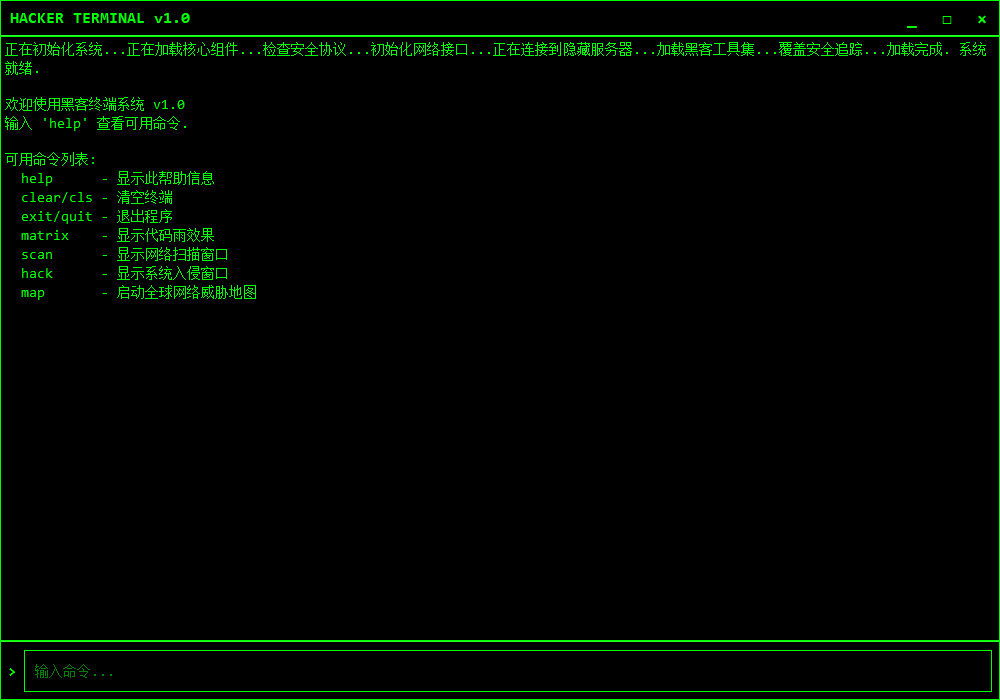

# Hacker Simulation Terminal System

[English](README_EN.md) | [中文](README.md)

A hacker simulation terminal program developed based on PyQt5, providing a visualized interface for simulating network attack and defense environments. This program is for network security education and research purposes only and does not provide actual intrusion functionality.



## Features

-   Simulated hacker terminal command line interface
-   Network scanner simulation
-   System intrusion simulation interface
-   Real-time visualization of global network threat map
-   Typing effect terminal output
-   Custom borderless window design
-   Realistic code rain effect
-   Attack animations and interactive features

## Installation Guide

### System Requirements

-   Python 3.6+
-   PyQt5 5.15.0+
-   Operating System: Windows/macOS/Linux

### Installation Steps

1. Install dependencies

```bash
pip install -r requirements.txt
```

## Usage

Run the main program:

```bash
python main.py
```

### Available Commands

After starting the program, you can use the following commands in the command line:

-   `help` - Display help information
-   `clear`/`cls` - Clear the terminal
-   `exit`/`quit` - Exit the program
-   `matrix` - Display code rain effect
-   `scan` - Launch network scanner window
-   `hack`/`breach` - Launch system intrusion window
-   `map` - Launch global network threat map

## Interface Description

### Main Interface

The main interface is a simulated hacker terminal, including a command input area and output display area. All features can be launched by entering the corresponding commands in the command line.

### Network Scanner

The network scanner provides a simulated network scanning function that allows you to:

-   Enter an IP address range to scan
-   Set port range
-   View scan results and open ports

### System Intrusion Interface

The system intrusion interface simulates the process of intruding into a remote system:

-   Displays target system information
-   Simulates attack process and progress
-   Provides attack logs and data viewing

### Network Threat Map

The global network threat map graphically displays simulated network attacks on a global scale:

-   Shows major country nodes and attack paths
-   Dynamically updates attack status
-   Provides attack types and statistics
-   Supports interactive viewing of attack details

## Development Information

### Project Structure

-   `main.py` - Program entry point
-   `main_window.py` - Main window and terminal interface
-   `network_scanner.py` - Network scanning module
-   `system_breach.py` - System intrusion module
-   `threat_map.py` - Network threat map module
-   `code_rain.py` - Code rain effect module

### Technical Details

-   Developed using the PyQt5 interface library
-   Custom animation effects implemented using Qt's drawing system
-   Multi-threading for animation and simulation data
-   Custom borderless window and title bar

## Disclaimer

This program is designed for simulation and educational purposes only and does not provide any actual network attack or intrusion functionality. Users should comply with relevant laws and regulations and should not use this program for any illegal purpose. The developer is not responsible for any misuse of this software.

## Contribution

Code contributions, bug reports, or feature suggestions are welcome. Please participate in project development through GitHub Issues or Pull Requests.

---

**Note:** This program is a visual simulator, and all "attacks" are simulated and will not affect any actual systems. 